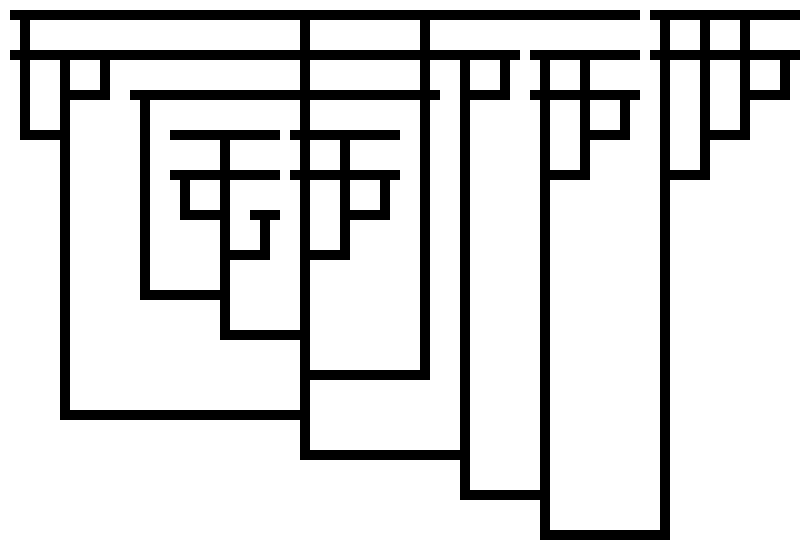

# pylambdac

Python tools for lambda calculus.

##  Why?

This is not an officially supported Google product.
This is not meant for some serious end; it's a toy to explore something I've been thinking about.

In order to define new [very large
numbers](https://googology.wikia.org/wiki/Googology_Wiki), people usually invent new notation, and
this process is less than perfectly formal. Where the number is computable, it would be cleaner
to represent these numbers as the output of a computer program, even though usually these numbers
are far too large for the program to actually run to completion. Since such definitions typically
make use of many higher-order functions, the pure, untyped [lambda
calculus](https://en.wikipedia.org/wiki/Lambda_calculus) is an appealing choice of language.
This also has the advantage of a convenient and attractive visual representation in the form
of a Tromp diagram.

For an example application, see this [detailed description of the largest number
defined](demofiles/f_fs.olc.md). This also describes a clean and convenient method for
representing computable countable ordinals with fundamental sequences which as far as I know is
original.

More output from this program [on my blog](https://mindsarentmagic.org/2020/02/24/some-more-numbers-as-lambda-calculus/).

## `olcrun`

`olcrun` interprets `.olc` files such  as those in the [`demofiles`](demofiles/) directory.

Install [poetry](https://python-poetry.org/), then try

    alias poetry='python3 $HOME/.poetry/bin/poetry'

    poetry update
    poetry run ./olcrun --outdir=/tmp/out demofiles/*

If the file ends in `.md`, the file is parsed as Markdown, the blockcode parts are extracted,
and this is then parsed as before. It's a very cheap and dirty form of literate programming :)

`.olc` files support the following directives ([grammar](pylambdac/grammar.lark)):

### `let`

`let `*`variable`*` = `*`expr`*`;` immutably binds a variable to the value given.

### `reduce`

`reduce `*`expr`* applies beta reduction to the given expression to reach weak head normal form. It's
a goal for this project to try to keep this somewhat readable, so:
  * we preserve variable names instead of using de Bruijn form,
  * we defer variable substitution until the variable is in the head position

### `magic Y`

Define a variable `Y` such that `Y f` is replaced with `f  (Y f)` when in head position. The Y
combinator can be defined in pure lambda calculus, but the reduction is much easier to follow when
the magic Y is used instead.

### `magic eager`

Define a variable `eager` such that if the expression is `eager `*`x`* then *`x`* is reduced if
possible. This is useful for measuring Church integers: if `n` represents an expression that
is equivalent to the Church integer 3, then `reduce n eager term;` reduces to
`eager (eager (eager term))`.

### `draw`

`draw `*`variable`* draws a [Tromp diagram](https://tromp.github.io/cl/diagrams.html) of the
expression named by the variable. Before drawing, free variables are substituted for their `let`
values, and beta reductions are performed wherever they reduce the size of the expression.
Finally the size of the expression in bits, represented using [binary lambda calculus](https://tromp.github.io/cl/Binary_lambda_calculus.html), is printed.

    olcrun --outdir <directory> <olcfile>

will additionally write the drawings as `.png` files to the directory named.

`draw` will fail if the expression contains undefined or "magic" names.

## Testing

To run tests, use `poetry run ./tests/run_tests`.

Each file in the [`tests/testdata`](tests/testdata/) directory contains a list of question/answer pairs.  To
guard against regressions, the `poetry run ./tests/rewrite_test` tool can be used to replace the
answers in such a file with the answers that the current version of the software generates.
